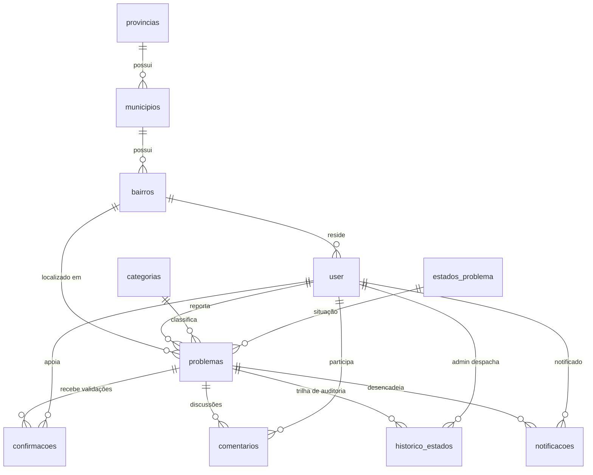

# Djumbai – Documento Oficial de Arquitetura e Memória do Projeto

> **Djumbai** (do Kimbundu: *"reunir, conversar juntos, convívio comunitário"*)
> Plataforma Cívica Digital para Reporte e Monitorização de Dificuldades Comunitárias em Angola.

---

## 1. Visão Geral & Problema Real em Angola

Em muitas comunidades e bairros de Luanda e das outras províncias (ex: Cazenga, Kilamba Kiaxi, Viana, Sambizanga, Rangel, Cacuaco, etc.), existem dificuldades quotidianas com:
- **Resíduos e Saneamento**: lixo acumulado nas esquinas, valas de drenagem entupidas;
- **Vias e Infraestruturas**: buracos nas vias principais e secundárias, ruas intransitáveis na época das chuvas;
- **Serviços Básicos**: cortes e falta de água potável (dependência de cisternas), iluminação pública apagada gerando insegurança.

Muitas vezes, estas queixas ficam dispersas em grupos de WhatsApp ou redes sociais sem acompanhamento oficial.
O **Djumbai** centraliza, documenta e dá visibilidade organizada às necessidades da população com:
1. **Registo com evidências** (fotografia, localização geográfica precisa, descrição e categoria);
2. **Confirmação coletiva** (*"Também acontece aqui"* — dando peso e veracidade ao reporte);
3. **Acompanhamento transparente** de estados (*Pendente → Em análise → Resolvido / Rejeitado*).

---

## 2. Identidade Visual & Cultura Angolana

A identidade visual foge do genérico e abraça as raízes da terra, a arte e as cores de Angola:

| Cor | Nome Cultural | Hex Code | Aplicação no Sistema |
|---|---|---|---|
| 🧱 | **Terra / Terracota** | `#B4451F` | Acentos primários, botões de ação principal, identidade visual |
| 🪵 | **Terracota Escuro** | `#8F3517` | Hover de botões, detalhes em relevo |
| 🛢️ | **Dendém** | `#D99A1E` | Estado *Pendente*, destaques dourados, padrões têxteis Samakaka |
| 🌿 | **Capim** | `#3F5A3C` | Estado *Resolvido*, botões de sucesso, indicadores positivos |
| 🌊 | **Baía** | `#1F6F6B` | Estado *Em análise*, temas marítimos de Luanda/Lobito, cards informativos |
| 🍷 | **Beterraba** | `#7A2E3B` | Categorias de saúde, alertas de atenção |
| 🏖️ | **Areia** | `#F6EEDD` | Fundo suave principal da página (warm background) |
| 📜 | **Cartão** | `#FFFBF2` | Fundo dos cards, superfícies elevadas e formulários |
| 🖋️ | **Tinta** | `#2B1D14` | Tipografia principal (substituto natural ao preto puro) |
| 🏺 | **Barro** | `#6B5A4A` | Tipografia secundária, bordas suaves, legendas |
| 📏 | **Traço** | `#D9CDB5` | Linhas divisórias e contornos geométricos |

### Elementos Gráficos Tradicionais:
- **Padrões Samakaka & Geometria Angolana**: faixas com ziguezagues, losangos e triângulos rítmicos;
- **Silhueta de Luanda**: Baía de Luanda, Ponte 4 de Abril, palmeiras e edifícios costeiros;
- **Ícones 100% Offline (SVG Inline)**: sem dependência de CDNs externos (FontAwesome/Google Fonts externos), funcionando em redes locais e ambientes com pouca conectividade.

---

## 3. Resumo da Base de Dados (11 Tabelas Oficiais)

A base de dados oficial (`database/djumbai.sql`) está estruturada e testada em 4 camadas lógicas:



1. **`provincias`**: As 18 províncias de Angola (`Luanda`, `Benguela`, `Huambo`, etc.);
2. **`municipios`**: Municípios vinculados à província (`Luanda`, `Cazenga`, `Viana`, `Belas`, etc.);
3. **`bairros`**: Bairros vinculados ao município (`Alvalade`, `Rangel`, `Hoji-ya-Henda`, `Talatona`, etc.);
4. **`categorias`**: Tipos de reporte (`Água`, `Estradas`, `Iluminação`, `Lixo e Resíduos`, `Saneamento`, `Transportes`, `Segurança`, `Saúde`, `Outros`);
5. **`estados_problema`**: `Pendente` (`#D99A1E`), `Em análise` (`#1F6F6B`), `Resolvido` (`#3F5A3C`), `Rejeitado` (`#B4451F`);
6. **`user`**: Moradores (`cidadao`) e administradores municipais/ONGs (`admin`), com `senha_hash` via Bcrypt;
7. **`problemas`**: Núcleo do sistema (`titulo`, `descricao`, `foto`, `referencia_local`, `user_id`, `categoria_id`, `bairro_id`, `estado_id`);
8. **`confirmacoes`**: Votos comunitários (*"Também acontece aqui"* — 1 por utilizador por problema);
9. **`comentarios`**: Diálogo e atualizações entre moradores da mesma zona;
10. **`historico_estados`**: Registo histórico e auditoria de cada alteração de estado feita pelos administradores;
11. **`notificacoes`**: Avisos aos moradores sobre a evolução dos problemas submetidos.

---

## 4. Roadmap de Execução (Fases de Implementação)

### 🔹 Fase 1: Interfaces & Experiência de Utilizador (Concluída/Em Curso)
- [x] **Homepage (`index.html`)**: Vitrine completa, panorama de Luanda com estatísticas animadas, cards de ações, "Como Funciona" com 3 passos, lista de problemas mais reportados, grelha de categorias e banner Samakaka.
- [x] **Tela de Login (`login.html`)**: Formulário autêntico com design acolhedor, visualizador de palavra-passe, validação de campos, atalhos para registo e recuperação.
- [x] **Tela de Cadastro (`cadastro.html`)**: Registo com seleção em cascata de província/município/bairro, dados de contacto de Angola (+244), termos comunitários e validação de palavra-passe em tempo real.
- [x] **Design Responsivo Completo**: Mobile (375px/390px), Tablet (768px), Laptop (1280px) e Desktop (1440px).

### 🔹 Fase 2: Backend MVC em PHP Puro & Autenticação
- [ ] Estrutura do Router (`Router.php`, `index.php`, `.htaccess`);
- [ ] Configuração de Banco de Dados (`config/Database.php` via PDO);
- [ ] Autenticação (`AuthController.php`): Sessões, login seguro com `password_verify()`, cadastro com `password_hash()`, logout;
- [ ] Middleware de proteção para Cidadão e Administrador.

### 🔹 Fase 3: Módulo de Reporte e Gestão de Problemas
- [ ] Formulário de novo reporte com upload de imagens sanitizado;
- [ ] Feed de problemas com filtros dinâmicos (por Bairro, Província, Categoria e Estado);
- [ ] Página de Detalhe do Problema com botão interativo de confirmação (*fetch AJAX*);
- [ ] Painel do Administrador para mudança de estado com registo no `historico_estados`.

---

## 5. Estrutura de Pastas do Projeto

```
djumbai/
├── app/
│   ├── Controllers/
│   ├── Models/
│   └── Views/
├── config/
│   └── database.php
├── database/
│   └── djumbai.sql
├── public/
│   ├── assets/
│   │   ├── icons/       # SVGs offline
│   │   └── images/
│   ├── css/
│   │   └── style.css    # Estilos com variáveis culturais
│   ├── js/
│   │   └── script.js    # Interatividade, máscaras e validações
│   ├── index.html       # Página Inicial
│   ├── login.html       # Tela de Acesso
│   └── cadastro.html    # Tela de Registo
├── djumbai.md           # Este documento de referência
└── README.md
```

---
*Documento mantido e atualizado para guiar o desenvolvimento integral do ecossistema Djumbai.*
